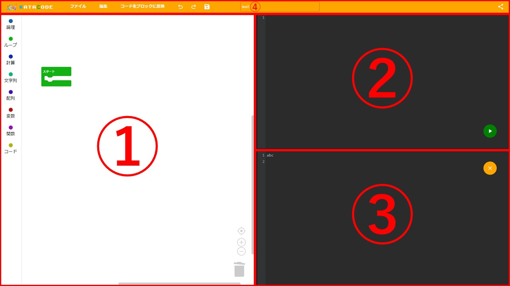

---
# サービス一覧
### 公式のサービスを利用する場合
https://katatsumuri-programming.github.io/visual_programming/

### 自分でサーバーに設置する場合
https://github.com/katatsumuri-programming/visual_programming/tree/mysql

---

# 主な機能
* blocklyを利用したブロックプログラミング
* ブロックをコードに変換後実行する事が可能
* コードをブロックに変換することが可能
* プロジェクトをブラウザに保存可能
* プロジェクトをfirebaseを利用して共有可能

# 使い方

1. 左側のツールボックスからブロックをドラッグアンドドロップしてつなげることでプログラミングできます。
2. 変換したコードが表示され、コードを編集することができます。右下のボタンをクリックするとコードを実行することができます。
3. 実行結果が表示されます。右上のボタンをクリックすることで出力をクリアすることができます。
4. メニューについては下のとおりです
<ul>
    <li>
        

            
ファイルメニュー

            <table>
                <tr><td>新規<td><td>新しいプロジェクトを作ります</td></tr>
                <tr><td>インポート<td><td>ローカルからプロジェクトをアップロードできます</td></tr>
                <tr><td>ダウンロード<td><td>プロジェクトをローカルにダウンロードできます</td></tr>
                <tr><td>開く<td><td>ダイアログが開き、ブラウザに保存したプロジェクトを開けます</td></tr>
                <tr><td>上書き保存<td><td>ブラウザ内にプロジェクトを上書き保存できます</td></tr>
                <tr><td>名前をつけて保存<td><td>ブラウザ内にプロジェクトを名前をつけて保存できます</td></tr>
                <tr><td>自動でブラウザに保存<td><td>自動でブラウザにプロジェクトを保存できます</td></tr>
                <tr><td>このプロジェクトを削除<td><td>プロジェクトをブラウザから削除します</td></tr>
            </table>
        

    </li>
    <li>
        

            
編集

            <table>
                <tr><td>元に戻す</td><td>ブロックをもとに戻します</td></tr>
                <tr><td>やり直す</td><td>ブロックをやり直します</td></tr>
                <tr><td>自動でコードを生成</td><td>自動でコードを生成します</td></tr>
                <tr><td>ブロックをコードに反映</td><td>ブロックをコードに反映させます</td></tr>
                <tr><td>ターボモード</td><td>evalで実行します</td></tr>
            </table>
        

    </li>
    <li>コードをブロックに反映</li>
    <li>元に戻す</li>
    <li>やり直す</li>
    <li>上書き保存</li>
    <li>ファイル名</li>
    <li>共有</li>
    </li>
</ul>